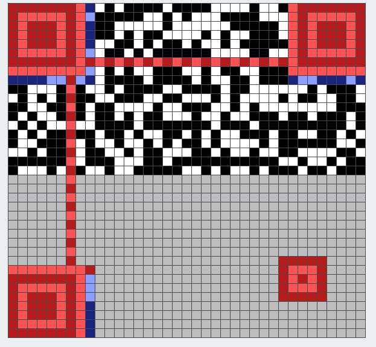
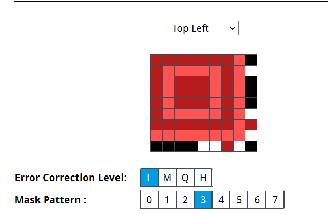
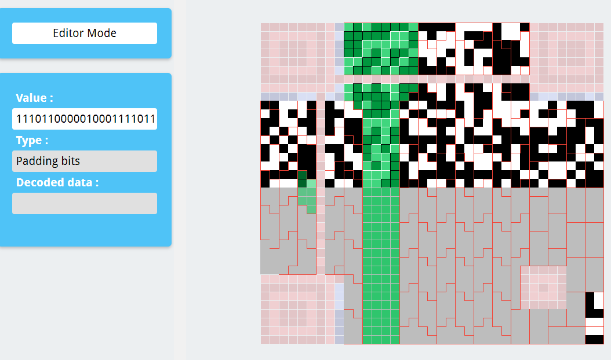

# How to recover a link from half part of the QR Code

By: wjh_@NGA

Note: this article and some scripts are written 2 month after finding the link, some data may be incorrect.

## 0x00 Useful Links

QRazyBox: QR Code Toolkit: https://merricx.github.io/qrazybox/

QR Code Tutorial: https://www.thonky.com/qr-code-tutorial/introduction

## 0x01 Start


We have this upper half of the QR Code.

## 0x02 Format Information

Open QrazeBox, in editor mode fill in the known part. (you can load half.jpg)



It's a 37x37, version 5 QR Code. The red part is a fixed pattern, for positioning. The blue part contains some format info. Click it and try those options, we can know it uses error correction level L(low), and mask pattern 3. (More info can be found [Here](https://merricx.github.io/qrazybox/help/getting-started/about-qr-code.html).)



In "Tool->Extract QR Information", we can see more information.

The low error correction level can correct up to 7% error, but we have 58.21%. We need to dig deeper into data blocks.("Final data bits" is corrupted, use "Data blocks" for further analysis.)

## 0x03 Data Blocks

From [Here](https://www.thonky.com/qr-code-tutorial/data-encoding) we can know how data is encoded.

For the most common used Byte Mode, the first 4 bits indicate the encoding mode, followed by a 8-bit binary integer indicating the length of the text. 

`0100 <8-bit length> <text bytes> 0000 <padding bytes> <error correction bytes>` 

The data bits should be like this. Note that text bytes are 4-bit shifted in data byte blocks.

We cut the first 12 bits from the data blocks, re-split it into 8-bit byte blocks and decode with ascii.

```python
data_blocks = ["????????","????????","????????","????????","????0111","00000111","00110011","10100010","11110010","1111????","????????","????????","????????","????????","????????","????????","????????","??110110","11110110","01110110","11000110","01010010","11??????","????????","????????","????????","????????","????????","????????","???10111","01100110","01010010","11110110","01100110","11110110","11000110","01000110","01010111","001?????","????????","????????","????????","????????","????????","????????","????????","????????","???10110","11010101","00100011","10000111","01110100","11010111","01010100","00110111","01100100","111?????","????????","????????","????????","????????","????????","????????","????????","????????","???10100","10100010","11010111","10010111","00110110","11100100","01100110","00010101","00100011","111?????","????????","????????","????????","????????","????????","????????","????????","????????","???10110","11100110","01110000","11101100","00010001","11101100","00010001","11101100","00010001","111?????","????????","????????","????????","????????","????????","????????","????????","????????","???10001","11101100","00010001","11101100","00010001","11101100","00010001","00011111","11000011","110?????","????????","????????","????????","????????","????????","????????","???01101","01011000","10111011","01011100","01111111","101?????","????????","????????","????????","????????","???00110","11001100","10010001","11011011","00101001","101?????","????????"]
data_bits = ''.join(data_blocks).replace('?', '0')[12:]
s = []
for i in range(0, len(data_bits), 8):
    s.append(int(data_bits[i:i+8], 2))
import subprocess
print(subprocess.check_output('xxd', input=bytes(s)).decode())
```

```
00000000: 0000 0070 733a 2f2f 0000 0000 0000 0003  ...ps://........
00000010: 6f67 6c65 2c00 0000 0000 0001 7665 2f66  ogle,.......ve/f
00000020: 6f6c 6465 7200 0000 0000 0000 0001 6d52  older.........mR
00000030: 3877 4d75 4376 4e00 0000 0000 0000 0001  8wMuCvN.........
00000040: 4a2d 7973 6e46 6152 3e00 0000 0000 0000  J-ysnFaR>.......
00000050: 0001 6e67 0ec1 1ec1 1ec1 1e00 0000 0000  ..ng............
00000060: 0000 0001 1ec1 1ec1 1ec1 11fc 3c00 0000  ............<...
00000070: 0000 0000 d58b b5c7 fa00 0000 0000 6cc9  ..............l.
00000080: 1db2 9a00 00  
```

Use linux tool `xxd` to examine decoded bytes. The middle part is the same as the shifted padding pattern `11101100 00010001`(`0xec11` in hex). And we guess that the text part is a google drive link.

## 0x04 Fill Back More Data

A google drive shared folder should math the regex `https://drive.google.com/drive/folders/1[0-9A-Za-z_\-]{32}\?usp=sharing` . 

From [Here](https://www.thonky.com/qr-code-tutorial/error-correction-table) we can know the size of each part. 

The total text length is 84 bytes, so we know the very first 12 bits should be `0100 01010100` . 

If we fill them in QRazyBox(Tool->Data Masking, Fill bits according to zig-zag layout mentioned [Here](https://merricx.github.io/qrazybox/help/getting-started/about-qr-code.html), and mask again), the Data Sequence Analysis tool will become available. You can use this tool to discover the data layout.(It's buggy and may corrupt data.)

(However it's unnecessary to use the tool anymore, because it won't give us more information.)



Also, we can fill the beginning and ending part of the link, and padding bits.

```python
def binary_encode(l):
    return ''.join('{:0>8b}'.format(i) for i in l)
origin_bits = ''.join(data_blocks)
known_bits = '0100' # mode
known_bits += binary_encode([84]) # length
known_bits += binary_encode('https://drive.google.com/drive/folders/1'.encode())
known_bits += '????????' * 32
known_bits += binary_encode('?usp=sharing'.encode())
known_bits += '0000' # zero pad to 8-bit
known_bits += '1110110000010001'*((108-86) // 2) # pad to 108 bytes
known_bits += '????????' * 26 # error correction
assert(len(origin_bits) == len(known_bits))
fixed_data_bits = ''.join(o if k == '?' else k for o, k in zip(origin_bits, known_bits))
fixed_blocks = []
for i in range(0, len(fixed_data_bits), 8):
    block = fixed_data_bits[i:i+8]
    if '?' in block:
        print(i // 8, block)
    fixed_blocks.append(int(block.replace('?', '0'), 2))
```


## 0x05 Error Correction

Let's check undetermined bytes and try to make use of error correction data.

```
41 0001????
42 ????????
43 ????????
44 ????????
45 ????????
46 ????????
47 ???10110
56 111?????
57 ????????
58 ????????
59 ????????
60 ????????
61 ????????
62 ????????
63 ????????
64 ????????
65 ???10100
110 110?????
111 ????????
112 ????????
113 ????????
114 ????????
115 ????????
116 ????????
117 ???01101
122 101?????
123 ????????
124 ????????
125 ????????
126 ????????
127 ???00110
132 101?????
133 ????????
```

QR Code uses [Reed–Solomon error correction](https://en.wikipedia.org/wiki/Reed%E2%80%93Solomon_error_correction). We don't have to know detail of the algorithm. All we need to notice is that it appends several (t = 26 bytes in our case) error correction blocks to the original message blocks (k = 108 bytes). And it can correct up to t errors if there location is known.

We have 33 errors, so the algorithm won't work directly. However, if we use brute force to enumerate 7 bytes, and use the algorithm to solve the left 26 bytes, we can recover some message. Then we test if it contains only valid characters in the URL to check whether it's that desired link.

We should use those bytes with less unknown bits, which are `[41, 47, 56, 65, 110, 117, 127]` . There are 26 bits unknown in total, so we need to call reed-solomon decode $2^{26}$ times. On my laptop it can run about 1800 rounds in one second, so it takes about 10 hours running on a single thread, and it can be parallelized.

```python
data = [69, 70, 135, 71, 71, 7, 51, 162, 242, 246, 71, 38, 151, 102, 82, 230, 118, 246, 246, 118, 198, 82, 230, 54, 246, 210, 246, 71, 38, 151, 102, 82, 246, 102, 246, 198, 70, 87, 39, 50, 243, 16, 0, 0, 0, 0, 0, 22, 213, 35, 135, 116, 215, 84, 55, 100, 224, 0, 0, 0, 0, 0, 0, 0, 0, 20, 162, 215, 151, 54, 228, 102, 21, 35, 247, 87, 55, 3, 215, 54, 134, 23, 38, 150, 230, 112, 236, 17, 236, 17, 236, 17, 236, 17, 236, 17, 236, 17, 236, 17, 236, 17, 236, 17, 236, 17, 236, 17, 31, 195, 192, 0, 0, 0, 0, 0, 0, 13, 88, 187, 92, 127, 160, 0, 0, 0, 0, 6, 204, 145, 219, 41, 160, 0] #fixed_blocks

b41s = [1<<4 | i for i in range(1<<4)]
b47s = [i<<5 | 0b10110 for i in range(1<<3)]
b56s = [0b111<<5 | i for i in range(1<<5)]
b65s = [i<<5 | 0b10100 for i in range(1<<3)]
b110s = [0b110<<5 | i for i in range(1<<5)]
b117s = [i << 5 | 0b01101 for i in range(1<<3)]
b127s = [i << 5 | 0b00110 for i in range(1<<3)]
## 7 bytes for enumeration
pos = [42,43,44,45,46,57,58,59,60,61,62,63,64,111,112,113,114,115,116,122,123,124,125,126,132,133] # 26 positons for reedsolo

from Crypto.Util.number import long_to_bytes, bytes_to_long
from string import ascii_letters, digits
c = (digits+ascii_letters+'-_').encode()

from itertools import product
def work(b56):
    import creedsolo # pip install reedsolo, "c" makes it faster
    rs = creedsolo.RSCodec(26)
    with open(f'qr/{b56-224}.txt', 'w') as f:
        data[56] = b56
        cnt = 0
        for b41, b47, b65, b110, b117, b127 in product(b41s, b47s, b65s, b110s, b117s, b127s):
            data[41] = b41
            data[47] = b47
            data[65] = b65
            data[110] = b110
            data[117] = b117
            data[127] = b127
            dec, _, _ = rs.decode(data, erase_pos=pos)
            shift = long_to_bytes(bytes_to_long(dec)<<4)
            if all(i in c for i in shift[41:67]): # valid url
                print(shift[2:86])
                print(shift[2:86], file=f, flush=True)
            cnt += 1
            if (b56 == 224 and cnt % 10000 == 0):
                print(f'{b56-224:>2}:{cnt/2**21*100}%')

from multiprocessing import Pool
with Pool(32) as p:
    p.map(work, b56s) ## byte 56
```

When running on a 32 CPU server (you can get it for about $~1.5/hour from many VPS providers), it takes less than 20 minutes to find the link. 

## 0x06 Recover QR Code Image

It's a much easier step.

```python
import qrcode
qr = qrcode.QRCode(
    version=5,
    error_correction=qrcode.constants.ERROR_CORRECT_L,
    mask_pattern=3
)
qr.add_data('https://drive.google.com/drive/folders/19cIWpimR8wMuCvNm8waUqzAMJ-ysnFaR?usp=sharing')
qr.make(fit=True)
qr.make_image(fill_color="black", back_color="white")
```


## 0x07 Conclusion

We recovered the link from only half of a QR Code which uses lowest error correction level.

The main reason is that the link pattern is known and provides more data.

